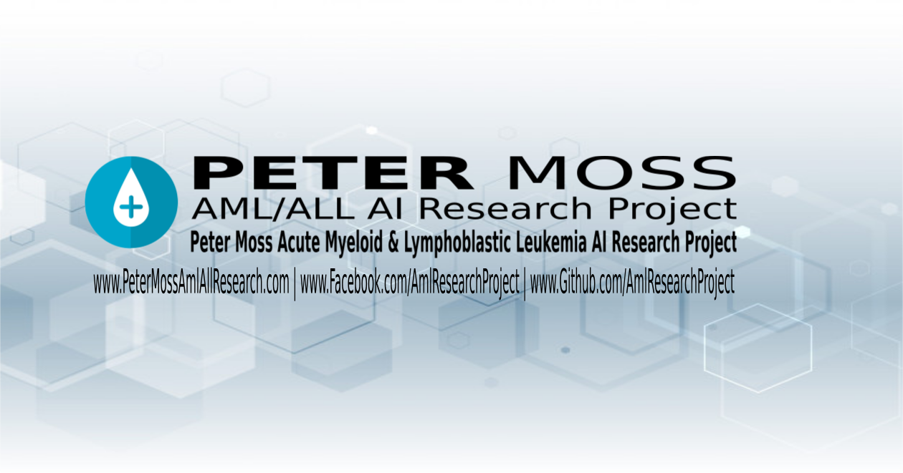

# Peter Moss Acute Myeloid & Lymphoblastic Leukemia AI Research Project
## Acute Lymphoblastic Leukemia PyTorch Classifier 2020

     

&nbsp;

# Table Of Contents

- [Introduction](#introduction)
- [DISCLAIMER](#disclaimer)
- [Getting Started](#getting-started)
- [ALL-IDB](#all-idb])
  - [ALL_IDB1](#all_idb1])
- [Contributing](#contributing)
  - [Contributors](#contributors)
- [Versioning](#versioning)
- [License](#license)
- [Bugs/Issues](#bugs-issues)

&nbsp;

# Introduction
Acute Lymphoblastic Leukemia PyTorch Classifier 2020 i an Acute Lymphoblastic Leukemia CNN programmed in Python using PyTorch.

&nbsp;

# DISCLAIMER

This project should be used for research purposes only. The purpose of the project is to show the potential of Artificial Intelligence for medical support systems such as diagnosis systems.

This project is not meant to be an alternative to professional medical diagnosis.

Developers that have contributed to this repository have experience in using Artificial Intelligence for detecting certain types of cancer. They are not a doctors, medical or cancer experts.

Please use this system responsibly.

&nbsp;

# Getting Started

To get started follow the [installation guide](Documentation/Installation.md) to find out how to clone the repository.

&nbsp;

# ALL-IDB

You need to be granted access to use the Acute Lymphoblastic Leukemia Image Database for Image Processing dataset. You can find the application form and information about getting access to the dataset on [this page](https://homes.di.unimi.it/scotti/all/#download) as well as information on how to contribute back to the project [here](https://homes.di.unimi.it/scotti/all/results.php). If you are not able to obtain a copy of the dataset please feel free to try this tutorial on your own dataset, we would be very happy to find additional AML & ALL datasets.

## ALL_IDB1 

In this project, [ALL-IDB1](https://homes.di.unimi.it/scotti/all/#datasets) is used, one of the datsets from the Acute Lymphoblastic Leukemia Image Database for Image Processing dataset. We will use data augmentation to increase the amount of training and testing data we have.

"The ALL_IDB1 version 1.0 can be used both for testing segmentation capability of algorithms, as well as the classification systems and image preprocessing methods. This dataset is composed of 108 images collected during September, 2005. It contains about 39000 blood elements, where the lymphocytes has been labeled by expert oncologists. The images are taken with different magnifications of the microscope ranging from 300 to 500."

&nbsp;

# Contributing

The Peter Moss Acute Myeloid & Lymphoblastic Leukemia AI Research project encourages and welcomes code contributions, bug fixes and enhancements from the Github.

Please read the [CONTRIBUTING](CONTRIBUTING.md "CONTRIBUTING") document for a full guide to forking our repositories and submitting your pull requests. You will also find information about our code of conduct on this page.

## Contributors

- [Adam Milton-Barker](https://www.leukemiaresearchassociation.ai/team/adam-milton-barker "Adam Milton-Barker") - [Asociacion De Investigation En Inteligencia Artificial Para La Leucemia Peter Moss](https://www.leukemiaresearchassociation.ai "Asociacion De Investigation En Inteligencia Artificial Para La Leucemia Peter Moss") President & Lead Developer, Sabadell, Spain

- Allen Akhaumere  - [Asociacion De Investigation En Inteligencia Artificial Para La Leucemia Peter Moss](https://www.leukemiaresearchassociation.ai "Asociacion De Investigation En Inteligencia Artificial Para La Leucemia Peter Moss") AI & Genomics R&D, Oworonshoki, Nigeria

&nbsp;

# Versioning

We use SemVer for versioning.

&nbsp;

# License

This project is licensed under the **MIT License** - see the [LICENSE](LICENSE.md "LICENSE") file for details.

&nbsp;

# Bugs/Issues

We use the [repo issues](issues "repo issues") to track bugs and general requests related to using this project. See [CONTRIBUTING](CONTRIBUTING.md "CONTRIBUTING") for more info on how to submit bugs, feature requests and proposals.